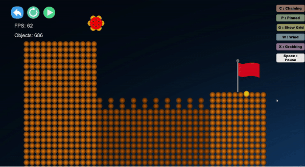
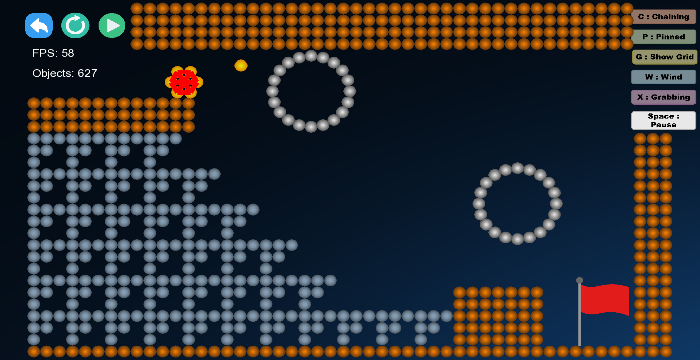

# Draw the Bridge

## Introduction

We implement a physics engine and use it to create a puzzle game. The engine consists of particle system and collision system.
Particle is the basic unit in this engine, we can use particles to form circle, rectangles, or triangles. The benefit of using particles is that we only need to implement collision for particles, we don't need to do it for every different objects. We use [Verlet integration](https://en.wikipedia.org/wiki/Verlet_integration) to simulate dynamic motion of particles.
Since there might be hundreds of particles collide at the same time, we need an efficient way to detect collisions. We choose to use collision grid (or uniform grid). It is easy to implement and very effective. The below images show the differences between using collision grid and not using it.

- Without collision grid
    
- With collision grid
    

## How to Play

Drag your mouse to draw a bridge to transport the ball to the goal

- `c`: Toggle chaining. If turned on, using the mouse to click any two particles will create a chain between them
- `p`: Toggle pinning. If turned on, gravity won't affect created particles. They will be pinned in their positions.
- `g`: Toggle showing grid.
- `x`: Toggle grabbing. If turned on, the ball will be attracted by the mouse.
- `Space`: Pause the game

## External libraries

- [SFML](https://www.sfml-dev.org/)
- [Index vector](https://github.com/johnBuffer/ConstantIndexVector)
- [Event manager](https://github.com/johnBuffer/SFML-EventManager)
- [Selba Ward](https://github.com/Hapaxia/SelbaWard)

## Assets

- [Gradient circular buttons](https://vapxiel.itch.io/gradient-circular-buttons)

## References

1. [Physics engine tutorial](https://www.youtube.com/watch?v=lS_qeBy3aQI)
2. [Collision detection optimization](https://www.youtube.com/watch?v=9IULfQH7E90)